##### CS-7641 Assignment 1 - Joshua Ruf

### Classification Problem 1

The first classification problem is to predict whether an employee will stay in their new job for at least 6 months. I work for an HR Analytics company that builds pre-hire survey modules to help our clients hire better. Being able to predicting employee retention is important to our clients as they can engage in better workforce planning.

These data are anonymized, and covers all employees hired between 2018-01-01 and 2022-03-01 so that a full 6 months of data will be available for each employee regardless of termination status. Including all hires up until today would introduce censorship bias as some employees are still employed but have not yet worked 6 months could potentially leave in the future, adding complexity beyond the scope of this assignment. The data includes a few sets of variables:

1. Basic demographic features such as age, ethnicity, and gender (where ethnicity and gender were coded as a series of binary variables)
2. Whether they are a manager and whether they were a referral (both binary)
3. Self-assessment overall score, and reference-assessment overall score
4. Self-reported strengths (series of binary variables)
5. Self-reported weaknesses (series of binary variables)
6. Self-reported skills (rated 1-5)
7. And of course, whether the employee terminated in the first 6 months of employment

Overall the 6 month termination rate across these employees is 12.7% meaning that these data have relatively high class imbalance. As a consequence, many models out-of-the-box simply guessed that all employees __would__ be employed until 6 months. As such, I chose to use the f1-score metric for model selection since it's more robust to class imbalance. The F1-metric jointly considers precision and recall, precision being the proportion of positive outputs that are truly positive, and recall being the proportion of all positive examples that the model labels as positive. Sklearn's [DummyClassifier](https://scikit-learn.org/stable/modules/generated/sklearn.dummy.DummyClassifier.html) makes the tradeoffs between accuracy and f1-score clear: when always guessing the most frequent value the test accuracy is 0.874 but the f1-score is 0.0 (the lowest possible value) since no negative samples are found and recall is zero. Conversely, when choosing randomly between True and False (weighted by their relative prevalence in the data), the DummyClassifier achieves a lower test accuracy of roughly 0.783 but a higher test f1-score of 0.168. These scores will serve as useful benchmarks in comparing subsequent models. The bottom line is, if we are willing to sacrifice some accuracy then we may be able to increase the probability that our models can identify negative examples in our data.

#### Decision Tree

I implemented sklearn's [DecisionTreeClassifier](https://scikit-learn.org/stable/modules/generated/sklearn.tree.DecisionTreeClassifier.html) with 1500 rounds of 5-fold cross validation. This achieved a training f1-score of 0.377358 and a testing f1-score of 0.290909, well outperforming the stratified DummyClassifier. In cross-validation I played with the following hyperparameters:

1. `Criterion`: how to select the feature on which to split each node (entropy and gini). In either case the "impurity" at a given node is compared to the average impurity of its leaves, weighted by leaf size--the difference is called "information gain". The CART algorithm checks the every feature to determine which gives rise to the largest information gain and chooses that feature for splitting. In practice entropy and gini are very similar and this hyperparameter can serve as a sanity check while exploring other parameters.
2. `splitter`: whether to choose the feature with the highest information gain, or instead, to choose the feature at random, weighted by the relative information gain. This can be helpful to avoid overfitting as the relative ordering of information gain could be a quirk in the training data.
3. `ccp_alpha`: a kind of pruning, whereby there is a cost to adding nodes to the tree and after some threshold growing will cease.
4. `max_features`: whether to consider all features at each node, or instead a random sample of the square root of the number of features. Decreasing access to information will hurt training but can avoid overfitting.
5. `min_samples_split`: the fewest number of samples necessary to split a node.
6. `min_samples_leaf`: the fewest number of samples necessary to be a leaf. Allowing larger leafs ensures that trees do not grow prohibitively large and that later splitting decisions are not so arbitrary.
7. `max_depth`: how many splits CART can perform before terminating.

In my data, criterion and splitter made little difference to performance, and limiting the number of features to consider in each split noticeably dropped performance. In theory, cpp_alpha, min_samples_split, min_samples_leaf, and max_depth all have similar goals of reducing tree size in an effort to minimize overfitting as larger trees tend to learn idiosyncrasies in the training data that do not generalize well to unseen data. In cross validation I saw them work together to reign in overfitting--the chosen model uses a specific combination however a visual analysis suggests that they are somewhat interchangeable. Ultimately my domain knowledge leads me to believe that decision trees are well suited to this problem. The survey module given to candidates asks related questions intentionally with the knowledge that they work together to explain work behaviors. For example, if a candidate responds yes to having strong time management skills, one might want to follow up with a question on work quality to see if corners are being cut. This is exactly how the CART algorithm thinks about data as well. However, I think CART runs into 2 problems: first, it's a greedy algorithm in that it will make the best split immediately even if a worse split could potentially segment the data in such a way that a better future split becomes possible. Second, CART with this many features to consider likely could have benefited from more samples for training.

#### Boosting

For boosting, I turned to sklearn's [AdaBoostClassifier](https://scikit-learn.org/stable/modules/generated/sklearn.ensemble.AdaBoostClassifier.html) with balanced class weights. I reused the hyperparameter grid I used to train the DecisionTreeClassifier, however I dropped the max depth of each tree to a maximum of 7, and I also tested changing the number of boosting iterations. In theory, so long as each tree in the AdaBoost ensemble is at least a "weak" learner, meaning it achieves an accuracy only slightly above 50%, then AdaBoost should improve upon the base classifier, and generalize better on unseen data. After 1000 rounds of 5-fold cross validation, the model achieved a f1-score of 0.3632 on the training set, and a f1-score of 0.3316 on the test set. 

There are a few things to note here, while AdaBoost performs worse on the training data than the base decision tree, it performs better on unseen testing data. This suggests that the decision tree was likely overfitting and restraining each tree had a positive impact. Specifically, each tree in the AdaBoost ensemble has a fewer number of nodes, considered fewer features when making each split, and chose the feature to split on at random instead of choosing the best one in terms of information gain. Together those changes mean that each tree is less likely to merely learn the quirks of the training data. That said, overfitting was still a problem while training AdaBoost, particularly in regard to the number of boosting iterations. By default, sklearn uses 50 trees in the ensemble, however I found increasing the number of estimators beyond 40 dropped the accuracy considerably. I think two forces are at play here: 1. my data is quite noisy in that employees' reasons for termination are never fully known and could be driven by forces entirely outside of one's control. Because AdaBoost continually upsamples more "difficult" examples that it previously labelled incorrectly, it likely spent a majority of its training time on the noisiest examples that are not representative of other unseen data. As well, because of class imbalance, achieving a 50% accuracy is almost certain and thus the mechanics of boosting on which AdaBoost relies might not be as relevant in this situation. Ultimately, AdaBoost outperformed its base estimator--the decision tree--but was not as large of an improvement as I expected.

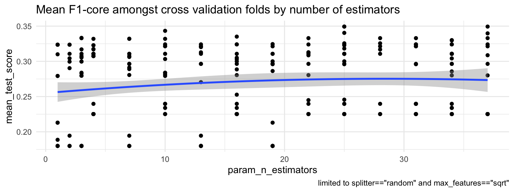

#### Support Vector Machine

I employed sklearn's support vector machine classifier, [SVC](https://scikit-learn.org/stable/modules/generated/sklearn.svm.SVC.html), achieving a training f1-score of 0.4856 and a testing f1-score of 0.3546 -- the highest of all classifiers. Through 1000 rounds of 5-fold cross validation I tested the following parameters:

1. `C`: regularization parameter, whereby larger values correspond to more strict hard-margin between classes, the [sklearn documentation](https://scikit-learn.org/stable/modules/svm.html#tips-on-practical-use) recommends decreasing C for noisy data.
2. `kernel`: the meat of the support vector machine, defines what space in which to "build" the hyperplane (but not actually because of the kernel trick). I tried these four options (`linear`, `poly`, `rbf`, `sigmoid`).
3. `degree`: degree of the polynomial in the case of a polynomial kernel
4. `gamma`: a coefficient in front of the kernel function, not applicable to the linear kernel
5. `coef0`: the constant in the radial basis and polynomial kernels

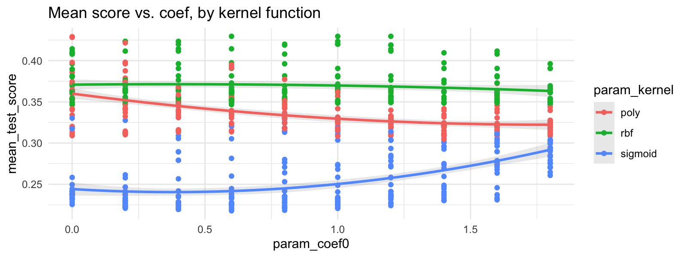
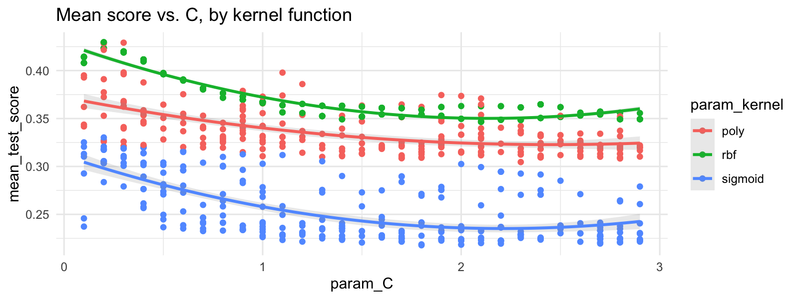

As expected, because of the likely noise in the data, the SVC performs worse as the regularization parameter, C, increases. The linear kernel performed terribly, clearly being unable to find a suitable hyperplane through the feature space. At this point I think it's worth noting that the number of features in the classification problem I devised is likely too high. With 47 features and just over 2000 observations the data is likely stretched too thin to generalize well to unseen data. This problem is known as "the curse of dimensionality" whereby the amount of data to be able to generalize to unseen samples grows exponentially as the number of features increases. In this assignment I considered using a simple dimensionality reduction technique such as a low variance threshold, however since I have another classification problem to work through I decided to let the problem persist and choose a slimmer dataset for contrast in problem 2.

In truth, I find support vector machines to be a bit of black magic. It's incredible that the kernel trick works as it does and that seemingly arbitrary functions can find better ways to segment data, but I find it incredibly difficult to incorporate "domain knowledge" into designing a kernel function as this courses' lectures advise. Ultimately, the radial basis kernel with a scaled gamma and relatively low regularization parameter performed really well. I attribute its triumph over the CART approaches above to two factors: first, decision trees and ensemble methods are very data hungry and especially a model like AdaBoost really benefits from training on significantly more data than I provided. Second, while creating a hyperplane through this feature space is a high dimensional problem, the ability for support vector machines to "zero out" certain observations that are not useful in constructing the hyperplane could reign in the consequence of training on noisy data. So ultimately whatever space the kernel creates for the hyperplane is likely to be sparse and focus on the few points that have explanatory power.

#### k-Nearest Neighbors

For sklearn's kNN implementation, [KNeighborsClassifier](https://scikit-learn.org/stable/modules/generated/sklearn.neighbors.KNeighborsClassifier.html), I ran into a bit of a problem, it doesn't contain any functionality to deal with the class imbalance out of the box. As such I ran two flavors of the model, one without doing anything to remedy the imbalance, and another randomly oversampling the minority class to get a 50-50 split via imbalanced_learn's [RandomOverSampler](https://imbalanced-learn.org/stable/references/generated/imblearn.over_sampling.RandomOverSampler.html). Without handling the class imbalance, kNN achieved an f1-score of 0.3289 on the training set and 0.3158 on the unseen test set. The training and testing scores are the closest across all the models tested, giving reason to believe that kNN is less prone to overfitting on these data. I tested two different weighting functions, the first equally weighted all k-observations in the voting function used to predict the output, while the second weighted them inversely proportional to their distance to the provided observation. Interestingly, this latter approach tended to overfit even at very low values of k, while the basic uniform weighting did not. I suspect that uniformly weighting all k neighbors was more robust to noise since the impact of a "noisy" observation is limited to 1/k whereas with distance weighting it could be the case that a single noisy observation has considerable weight and entirely dictates the output. As well, the feature space is high dimensional, so distances between samples can be high even if they share a number of properties, another consequence of the curse of dimensionality.

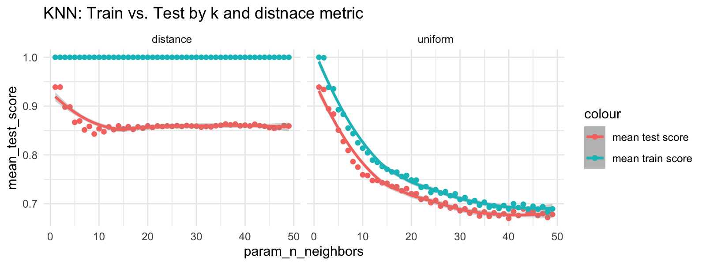

Lastly, the kNN model that attempted to manage class imbalance did not fare any better, likely because of the rough-and-dirty approach I took to handling the imbalance. It achieved a f1-score of 1.0 on the training set and 0.3 on the testing set, a clear example of overfitting. It should be noted that since the entire training set is "stored" within the kNN model (ready to be deployed to classify an example), its training f1 score and accuracy are not very useful metrics. Still, the large discrepancy between testing and training scores suggest that an alternative approach to handling class imbalance is needed.

#### Neural Network

I trained a vanilla fully connected feed forward neural network with [pytorch](https://pytorch.org/), using [Binary Cross Entropy](https://pytorch.org/docs/stable/generated/torch.nn.BCELoss.html) as my loss function and standard [stochastic gradient descent](https://pytorch.org/docs/stable/generated/torch.optim.SGD.html) as my optimizer. Between each layer, a sigmoid unit added non-linearity and I upsampled the minority class during training to deal with class imbalance. Overall the model performed well, but was clearly prone to overfitting as is common for neural networks. The overall train f1-score was 0.5247, the highest of all models, while the test score was 0.3243. To choose the best model I ran the model 200 times, varying the following hyperparameters:

1. dimension of the hidden layer (4-32)
2. dropout rate, or rather the proportion of weights that are set to zero after each internal layer, a technique that restrains the model in an effort to reduce overfitting (0-0.4)
3. batch size, or the number of observations used to measure the gradient at each training iteration (4-32)
4. optimizer's momentum, or how much of the previous training iteration's velocity does the model keep in each subsequent iteration, the idea being that if the gradient is close to zero then momentum might be able to avoid getting stuck in a local minimum (0-1). Note that in pytorch's implementation of SGD, momentum==1 does not mean that the gradient at each iteration is unused.
5. optimizer's learning rate, or how large of a step the optimizer takes in the direction of the velocity vector (0.005, 0.020)
6. epochs, or the number of times to iterate through the entire testing dataset (50-500). More epochs runs the risk of overfitting, however a lower learning rate could offset this potential outcome.

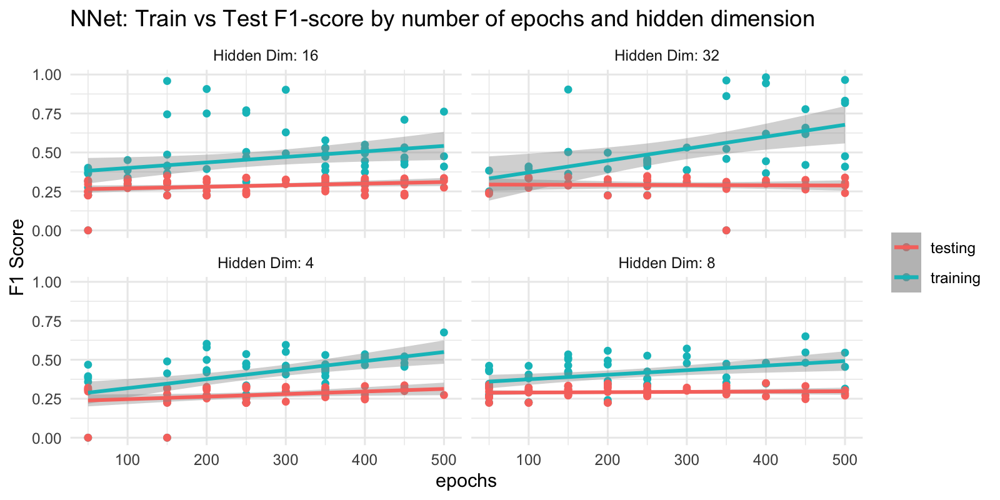
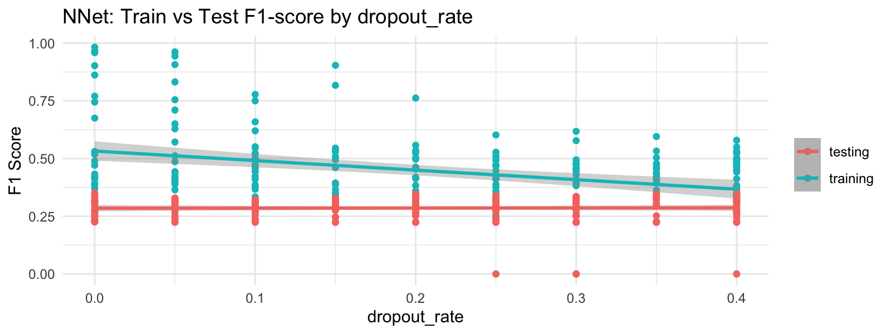

Overall I saw that a larger batch size performed better, likely because the resulting velocity vector at each step was less influenced by random noise in the samples. The best hidden dimension was found to be 16, higher values greatly improved the training f1 score but not the testing score indicating overfitting, while fewer dimensions does not appear expressive enough to learn the data. Finally, the dropout rate appeared to have a significant impact in that training f1-score fell with higher dropout rates while testing remained constant, suggesting that it reigned in the model and reduced overfitting. The learning rate chosen was less than the default value, likely offset by a relatively high number of epochs and a high momentum.

### Classification Problem 2

I'm a huge fan of the late film critic Roger Ebert who passed away in 2013. After his death, other critics began writing for [his website](rogerebert.com), but things were not the same. Ebert used a 4 star rating system, and reserved an ultimate rating *"great movie"* for films he especially loved. Since 2013 however, no other critics have used this extra designation, leaving me to wonder: do any of the films reviewed since his death deserve to be added posthumously into Ebert's "great movie" list?

To answer this question, I scraped all 3.5 and 4 star reviews from his website, resulting in 3527 reviews, 2415 of which Ebert wrote. Amongst all Ebert's 3.5 and 4 star reviews, 13.6% are deemed "great movies". As an aside, there are no 3.5 star reviews with the "great movie" designation, however I figured the difference between 3.5 and 4 cannot be that large and including these lesser reviews will increase my sample size.

The labels are a simple boolean value for whether the film is a great movie, and the features are constructed from the text body of the review itself, passing the review through a basic sentiment analysis program. Python's NLTK package has the [SentimentAnalyzer](https://www.nltk.org/_modules/nltk/sentiment/sentiment_analyzer.html) class that returns the negative score, positive score, neutral score, and compound score. I also added the character length of the review. This totalled 5 features, far fewer than the first problem. The sentiment analysis is a crude metric in that it boils down several paragraphs of text into just four numbers, however in the interest of brevity I deemed this to be sufficient.

The models and cross validation conditions tested for this problem are exactly the same as those used in the first problem so I won't go into the same detail about the conditions tested. While some of these hyperparameters are likely suboptimal on this dataset, I figured it would make for an interesting comparison with the previous problem. On these data, the stratified DummyClassifier the benchmark f1-scores are 0.1434 on the training set, and 0.0870 on the testing set.

#### Decision Tree

The decision tree classifier achieved a f1-score of 0.8691 on the training set and 0.9231 on the testing set. Compared to the first classification problem, this is a far better score. I believe this is the case because the feature space is far smaller and there is less potential for noise to influence training. For example, the decision tree almost always prefers to split nodes based on the best feature (in terms of information gain) instead of randomly selecting from amongst the best features. As well, with fewer features to decide between, choosing the 3rd best for instance is a considerable difference than when there were more than 40 features.

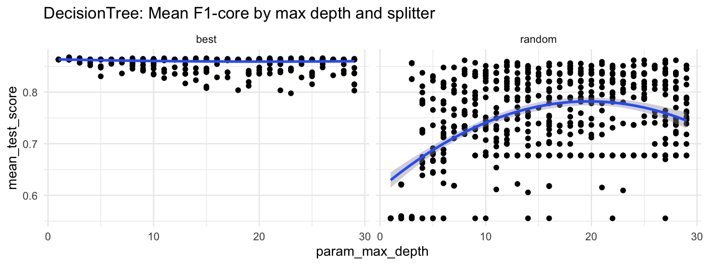

#### Boosting

AdaBoost achieved a f1-score of 0.8591 on the training set and 0.93617 on the testing set. Like in the previous classification problem, this performs slightly worse on the training set than its base classifier, but better on the testing set. This points to the same dynamic whereby aggressively pruning each base learner prevents overfitting. Since each base learner is so much weaker, we see a higher variance of f1-scores when the number of estimators is low.

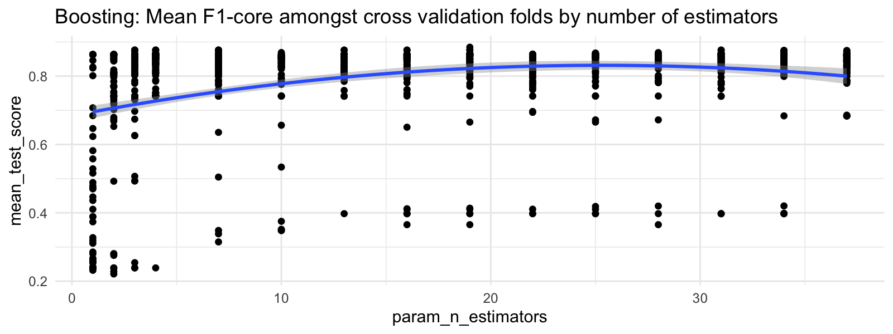

#### Support Vector Machines

SVC achieved the highest f1-score on the training set of all the models tried, 0.879456706281834 and a score of 0.915492957746479 on the test set. Interestingly, the `C` regularization parameter has the opposite effect on these data than problem 1. Since these data have so many fewer features, and I suspect less noise, we can enforce a more "hard" margin between the classes such that higher values of the regularization parameter performs better. The kernel is also different than the other problem, favoring the polynomial kernel.

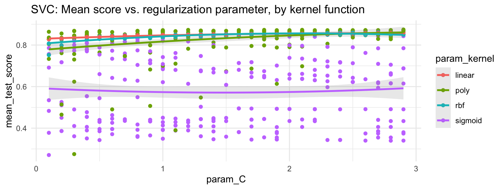

#### k-Nearest Neighbors

kNN achieved an f1-score of 0.868131868131868 on the training set and 0.885496183206107 on the test set. The dynamics were largely similar to the first classification problem since there is not that much tuning involved in kNN.

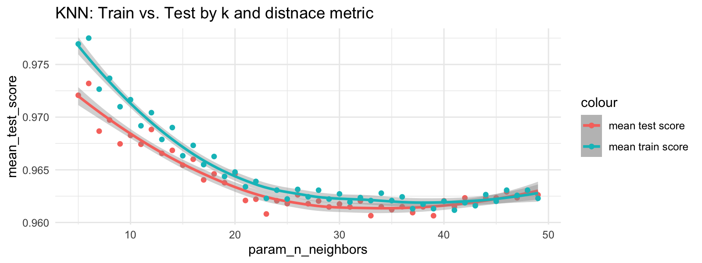

#### Neural Networks

Finally, the neural network performed the best on this classification problem, with a training f1-score of 0.880546 and testing f1-score of 0.942857. Training appeared to go much smoother on these data and the best model was often found towards the end the training epochs, meaning that additional training was less prone to overfitting. The testing f1-score generally increases with the size of the fully connected hidden layer--which is somewhat surprising because of how much larger the hidden layer is than the input layer, 16 compared to just 5. One would think that adding that many additional training parameters would tend to overfit, but that does not appear to be the case.

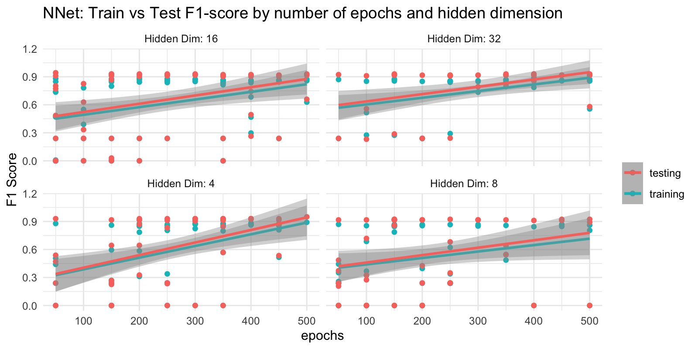

##### So, what films since 2013 are "great movies"?

Since the neural network performed best on the test set, I opted to use it to classify the non Roger Ebert reviews. Of the 1112 reviews, 232 were classified as "great movies" (20.9%). This is higher than his proportion but I can live with that. Interestingly, the particular writing styles of specific reviewers seems to matter a great deal, with most reviewers not having any predicted great movies. It seems likely that critics with many predicted great movies have matched Ebert's _sentiment_ in their reviews... I wonder if this was intentional. As well, 4 star reviews are much more likely to be "great movies" than 3.5 star reviews, this serves as a nice sanity check. For the full list of films and their predictions click [here](predicted_great_movies.md).

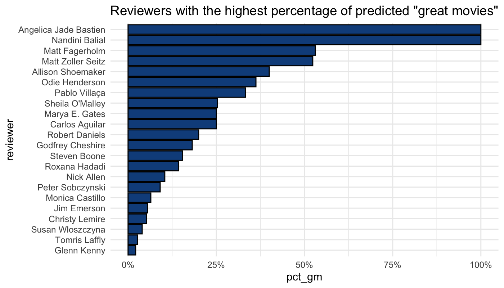

### Conclusion and Comparison

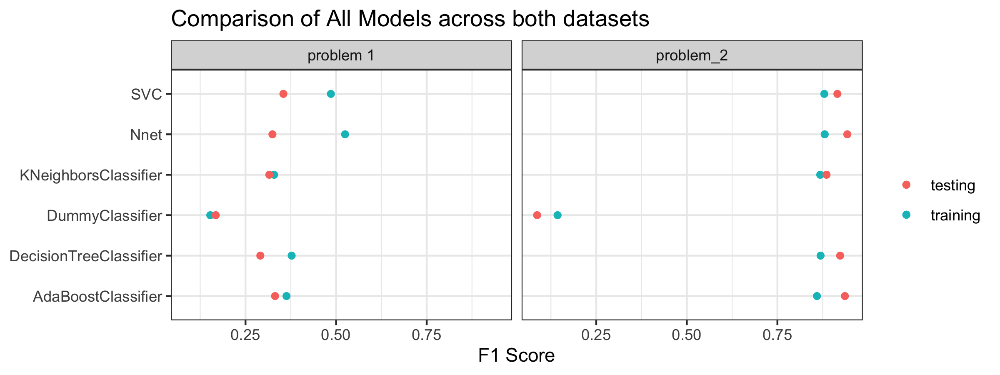

Overall, it seems obvious to me that data preparation and feature selection is as important as model selection and training itself. These two datasets are dissimilar in that the first has over 40 features while the second just five. I did not run any kind of variable selection algorithm, though were I to make an improvement upon what I've done that would be at the top of my list. When processing the Roger Ebert reviews I almost used a word vector algorithm that would have put the reviews into a much larger dimensional space than the 5 features I used in training, I think with more data this would have been feasible but given my limitations I'm happy with my choice.

In truth, I doubt that either problem ha truly enough data to let the models train unguided by at least some domain knowledge. To me the regularization parameter in the support vector machine is the best example of this whereby knowing how "noisy" the data is can have a significant performance boost. Of course, we can learn that parameter through cross validation, but imagining a situation with much more data and longer training times that would be easier said than done. Moreover, on processing times, everything with the exception of the neural network trained very quickly, and even evaluating the kNN algorithm didn't take very long (likely because of the small sample).

